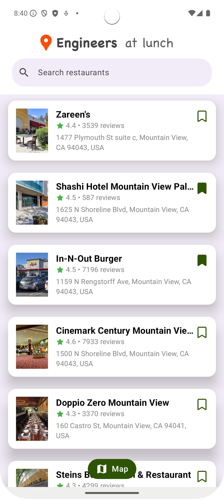
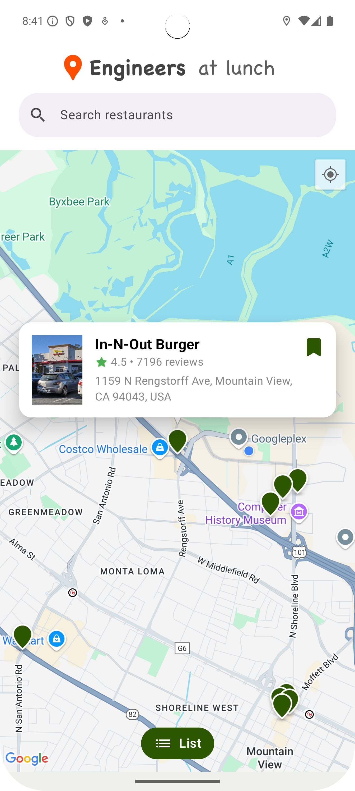
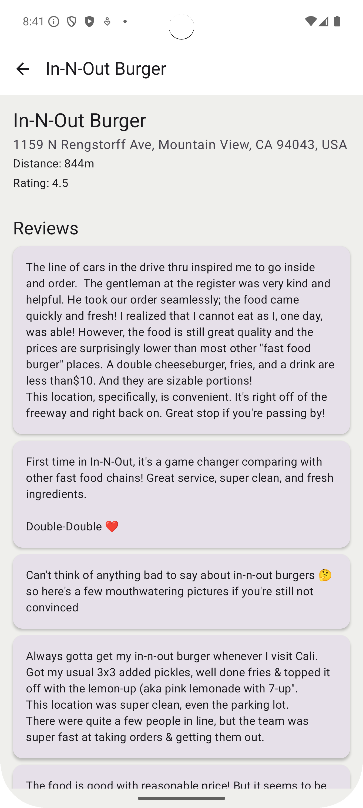

# Lunchtime Restaurant Discovery

Lunchtime Restaurant Discovery: An Android App That Demonstrates Best Practices

## Brief Project Description

LunchTime is a modern Android application built with best practices and latest technologies. This
project was created using the default Android Studio New App template (Empty Activity) and
implemented as a Kotlin Jetpack Compose project.

## Original SPEC (Required Features)

- The app will use the Google Places API as its data source.
- The app will prompt the user for permission to access their current location.
- Upon launch, the app will execute a search and display nearby restaurants.
- A search feature will allow the user to search for specific restaurants.
- Users can choose to display search results as a list or as pins on a map.
- Selecting a search result will display basic information about the restaurant.
- Third-party libraries may be used at the developer's discretion, but the Google Places API client must not be used.
- Users can flag restaurants as favorites, with favorite status reflected in current and future search results.

## Build Instruction

For security best practices, sensitive information such as the Google Places API key is stored in
`gradle.properties` and excluded from GitHub. The file is included in the repository with a
placeholder - please replace it with the actual API key value before you build the project.

## Environment

- Android Studio Ladybug | 2024.2.1 Patch 2
- Gradle Version: 8.9

## Architecture & Design Patterns

- Clean Architecture with clear separation of concerns:
    - Data Layer (Repository Pattern)
    - Domain Layer (Use Cases/Business Logic)
    - Presentation Layer (MVVM with ViewModels)

- Single Activity architecture using Jetpack Compose
- Unidirectional Data Flow using `StateFlow`
- State Management using `sealed` classes for UI states
- State Encapsulation in ViewModels (`MutableStateFlow` field is always private)
- Error Handling with `Result`

## Key Technologies & Libraries

- UI:
    - Jetpack Compose for declarative UI
    - Material Design 3 components
    - Google Maps Compose 
- Networking:
    - [Ktor Client](https://ktor.io/docs/client-create-and-configure.html#configure-client) for HTTP requests 
      - Native coroutines support
      - Lightweight and flexible compared to Retrofit
      - Easy configuration and interceptors
    - [Coil Compose](https://coil-kt.github.io/coil/compose/) for image loading and caching
      - Built specifically for Compose with native integration
      - Memory and disk caching out of the box
      - Coroutines-based image loading
      - Smaller footprint compared to Glide/Picasso
    - Kotlin Serialization for JSON parsing
      - Compile-time type safety
      - Better performance than Gson/Moshi
      - Native Kotlin support with less boilerplate
      - Direct integration with Ktor
- Dependency Injection:
    - Hilt
- Asynchronous Operations:
    - Kotlin Coroutines & Flow
- Data Persistence:
    - DataStore for lightweight favorites storage
 - Location-based services:
    - [FusedLocationProvider](https://developers.google.com/location-context/fused-location-provider)
      - Simplified API compared to LocationManager
      - Battery-efficient
- Testing:
    - Unit tests with JUnit4
    - MockK for mocking
    - Coroutines test utilities
    - Custom test rules for [coroutines testing](https://developer.android.com/kotlin/coroutines/test)

## Screenshots

<table>
  <tr>
    <td>List View</td>
     <td>Map View</td>
     <td>Details View</td>
  </tr>
  <tr>
    <td></td>
    <td></td>
    <td></td>
  </tr>
 </table>

## Documentation

- Google Places API
    - [Nearby-Search](https://developers.google.com/maps/documentation/places/web-service/nearby-search)
    - [Text-Search](https://developers.google.com/maps/documentation/places/web-service/text-search)
    - [Place-Photos](https://developers.google.com/maps/documentation/places/web-service/place-photos)
    - [Place-Details](https://developers.google.com/maps/documentation/places/web-service/place-details)
- Android Map Compose
    - [Documentation and Examples](https://github.com/googlemaps/android-maps-compose)
- Android DI (Dagger and Hilt)
    - [Cheatsheet](https://developer.android.com/training/dependency-injection/hilt-cheatsheet)
- Android Best Practices
    - [ViewModel/Repository/Coroutines](https://developer.android.com/kotlin/coroutines/coroutines-best-practices)
    - [Flow](https://developer.android.com/kotlin/flow)
    - [runCatching](https://dev.to/1noshishi/mastering-runcatching-in-kotlin-how-to-avoid-coroutine-cancellation-issues-5go2)

## Walk Through the Implementation

At its core, this app uses the Google Places API to fetch and display nearby restaurants based on the user's location.

When you launch the app, it starts by asking for location permission in a user-friendly way, explaining why it's needed. Once permission is granted, the app fetches nearby restaurants and displays them. There's also a real-time search feature, so users can find specific places, and they can switch between a list view and a map view, with pins placed on the map using Google Maps Compose.

Selecting a restaurant brings up basic details like name, address, and ratings. A cool bonus: users can favorite restaurants, and that status is saved.

I followed Clean Architecture principles, splitting the app into three layers:

- Data Layer using the Repository Pattern for clean data handling.
- Domain Layer, where all the business logic lives in reusable use cases.
- Presentation Layer, built with Jetpack Compose and MVVM, which keeps the UI reactive and maintainable.
- For state management, I used StateFlow with a unidirectional data flow, which simplifies updates and keeps things predictable. Errors are managed using a Result wrapper, and sealed classes help define clear UI states.

On the tech stack side, I used:

- Ktor Client for networking—lightweight, flexible, and coroutine-friendly.
- Coil for image loading—optimized for Compose with caching baked in.
- DataStore for simple favorites persistence.
- Hilt for dependency injection.
- And FusedLocationProvider for battery-efficient location tracking.

Testing was also a focus. I wrote unit tests with JUnit4 and mocked dependencies with MockK, using coroutine testing tools for asynchronous workflows.

Finally, I went beyond the requirements by adding distance-based sorting for a better user experience and handling errors gracefully. I kept things simple, like skipping local caching with Room DB, but that's an easy extension if needed in the future.

In summary, this app highlights my ability to use modern Android tools and patterns to build a scalable, high-quality app while maintaining simplicity and performance. I'm excited to answer any questions or dive deeper into the code if you're curious.

## Contact

Connect and follow me on LinkedIn: [Sergey N](https://www.linkedin.com/in/sergey-neskoromny/)