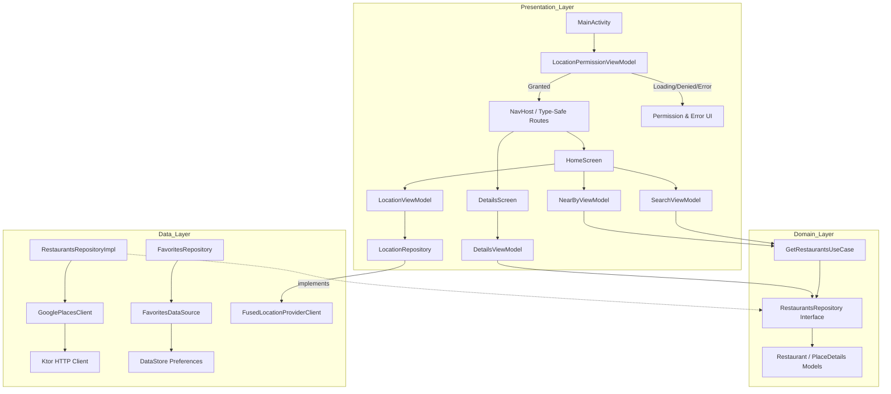
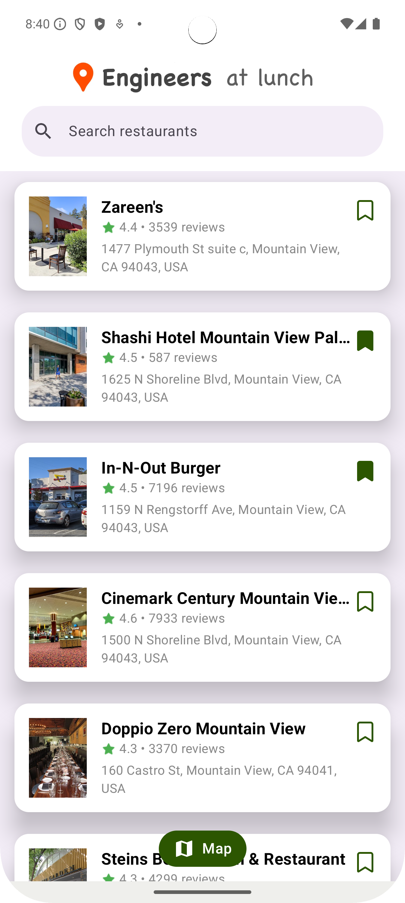
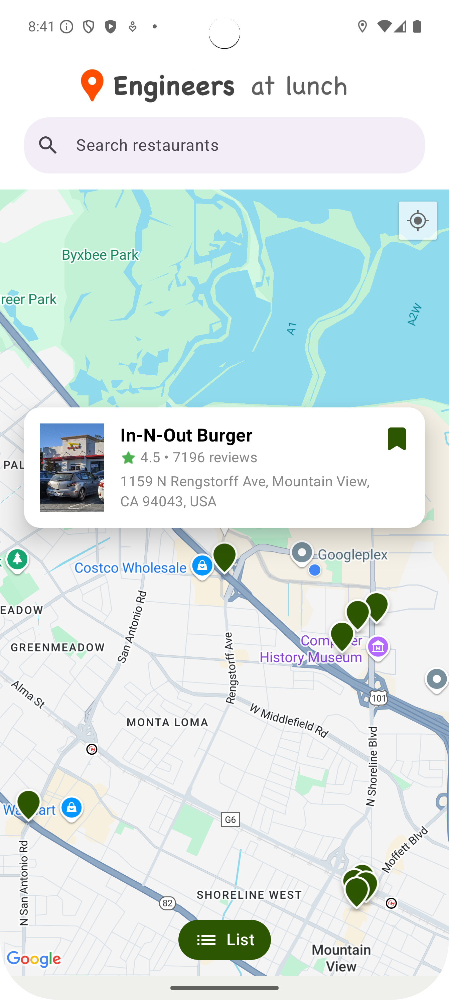
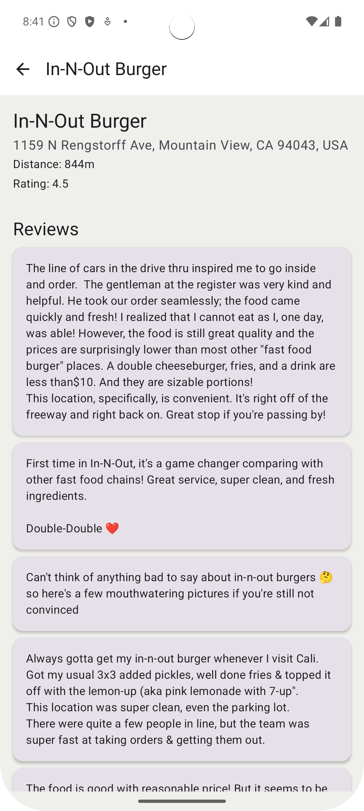

# Lunchtime Restaurant Discovery

[](https://opensource.org/licenses/MIT)
[](https://www.android.com/)
[](https://kotlinlang.org/)
[](https://github.com/sergenes/restaurantdiscovery/tags)


Lunchtime: A Restaurant Discovery App Showcasing Android Best Practices (Playground)

## Brief Project Description

Lunchtime is a modern Android application built with best practices and latest technologies. This
project was created using the default Android Studio New App template (Empty Activity) and
implemented as a Kotlin Jetpack Compose project.

## Original SPEC (Required Features)

- The app will use the Google Places API as its data source.
- The app will prompt the user for permission to access their current location.
- Upon launch, the app will execute a search and display nearby restaurants.
- A search feature will allow the user to search for specific restaurants.
- Users can choose to display search results as a list or as pins on a map.
- Selecting a search result will display basic information about the restaurant.
- Third-party libraries may be used at the developer's discretion, but the Google Places API client must not be used.
- Users can flag restaurants as favorites, with favorite status reflected in current and future search results.


## Build Instruction

For security best practices, sensitive information such as the Google Places API key is stored in
`local.properties` (referenced via `BuildConfig`) and excluded from GitHub.

### How to obtain the API key:
1.  Go to the [Google Cloud Console](https://console.cloud.google.com/).
2.  Create or select a project.
3.  Enable the **Places API (New)**.
4.  Go to **APIs & Services > Credentials** and create an **API key**.
5.  Add `google.places.api.key=YOUR_API_KEY` to your `local.properties` file.

## Environment

- Android Studio Ladybug | 2024.2.1 Patch 2
- Gradle Version: 8.9
- Android Gradle Plugin: 8.13.2
- Kotlin: 2.0.0
- Compile SDK: 36
- Min SDK: 24
- Target SDK: 36

## Testing

The project includes comprehensive test coverage focusing on meaningful tests rather than just coverage metrics:

**Unit Tests** (Fast, no device needed):
```bash
./gradlew test
```
- `GetRestaurantsUseCaseTest` - Business logic (distance sorting)
- `SearchViewModelTest` - Debouncing behavior and search flow
- `BaseViewModelTest` - Shared loading/error handling utilities
- `FavoritesViewModelTest` - Toggle favorites logic
- `DestinationsTest` - Navigation serialization
- `LocationViewModelTest` - Location update flow and refresh behavior
- `LocationPermissionViewModelTest` - Permission state machine and callbacks

**Android Instrumentation Tests** (Requires device/emulator):
```bash
./gradlew connectedAndroidTest
```
- `FavoritesDataSourceTest` - Real DataStore persistence and concurrent operations

## Architecture & Design Patterns

- **Clean Architecture** with clear separation of concerns:
    - Data Layer (Repository Pattern)
    - Domain Layer (Use Cases/Business Logic)
    - Presentation Layer (MVVM with ViewModels)

- **Type-Safe Navigation**: Uses the latest Jetpack Navigation (2.8.0+) with Kotlin Serialization for compile-time safe routing
- **Single Activity** architecture using Jetpack Compose
- **Unidirectional Data Flow** using `StateFlow`, and actions are passed up via lambdas
- **State Management** using `sealed` classes for UI states
- **State Encapsulation** in ViewModels (`MutableStateFlow` field is always private)
- **Error Handling** with `Result` and centralized error state management
- **Dependency Injection**: Powered by Hilt for modular and testable code
- **BaseViewModel Pattern**: Eliminates code duplication with shared `executeWithLoading` helper for consistent loading/error handling
- **Centralized Design System**: `Dimens.kt` for consistent spacing and eliminating magic numbers
- **Search Debouncing**: 500ms debounce to reduce API calls while user types
- **Scoped ViewModel Separation**: Permission and location concerns are split into two focused ViewModels with different lifetimes:
    - `LocationPermissionViewModel` (Activity-scoped) — owns the permission state machine; `MainActivity` only recomposes when permission state changes (grant/deny), which is rare
    - `LocationViewModel` (HomeScreen-scoped) — owns continuous GPS updates; starts immediately on composition since permission is already guaranteed by the time `HomeScreen` is shown
- **Compose Recomposition Scoping**: Location ticks only recompose the composables that actually consume location:
    - `HomeScreenLayout` is a pure layout composable with a `restaurantContent` slot — it has no location parameter and is unaffected by GPS updates
    - `RestaurantContent` collects `locationState` directly from `LocationViewModel`; only the map pin position (`RestaurantMapView`) redraws on each tick — the list, search bar, and scaffold are skipped by Compose
    - `currentViewType` (list vs. map) is hoisted to `HomeScreenContent` with `rememberSaveable`, preserving the user's view choice across NearBy loading cycles and location refreshes
- **Fresh GPS on Every Session**: `LocationRepository` uses `getCurrentLocation()` (not `lastLocation`) as the initial emission, avoiding the stale OS-level cache that persists across app restarts



```mermaid
graph TD
    subgraph Presentation_Layer
        MA[MainActivity] --> PVM[LocationPermissionViewModel]
        PVM -- Granted --> NavHost[NavHost / Type-Safe Routes]
        PVM -- Loading/Denied/Error --> PermUI[Permission & Error UI]
        NavHost --> HS[HomeScreen]
        NavHost --> DS[DetailsScreen]
        HS --> LVM[LocationViewModel]
        HS --> VM1[NearByViewModel]
        HS --> VM2[SearchViewModel]
        DS --> VM3[DetailsViewModel]
        LVM --> LR[LocationRepository]
    end

    subgraph Domain_Layer
        VM1 & VM2 --> UC[GetRestaurantsUseCase]
        VM3 --> Repo
        UC --> Repo[RestaurantsRepository Interface]
        Repo --> Model[Restaurant / PlaceDetails Models]
    end

    subgraph Data_Layer
        RepoImpl[RestaurantsRepositoryImpl] -. implements .-> Repo
        RepoImpl --> GPC[GooglePlacesClient]
        GPC --> Ktor[Ktor HTTP Client]

        FavRepo[FavoritesRepository] --> FDS[FavoritesDataSource]
        FDS --> DS_Prefs[DataStore Preferences]

        LR --> FLP[FusedLocationProviderClient]
    end
```

## Key Technologies & Libraries

- UI:
    - Jetpack Compose for declarative UI
    - Material Design 3 components
    - Google Maps Compose
- Networking:
    - [Ktor Client](https://ktor.io/docs/client-create-and-configure.html#configure-client) for HTTP requests
      - Native coroutines support
      - Lightweight and flexible compared to Retrofit
      - Easy configuration and interceptors
    - [Coil Compose](https://coil-kt.github.io/coil/compose/) for image loading and caching
      - Built specifically for Compose with native integration
      - Memory and disk caching out of the box
      - Coroutines-based image loading
      - Smaller footprint compared to Glide/Picasso
    - Kotlin Serialization for JSON parsing
      - Compile-time type safety
      - Better performance than Gson/Moshi
      - Native Kotlin support with less boilerplate
      - Direct integration with Ktor
- Dependency Injection:
    - Hilt
- Asynchronous Operations:
    - Kotlin Coroutines & Flow
- Data Persistence:
    - DataStore for lightweight favorites storage
- Location-based services:
    - [FusedLocationProvider](https://developers.google.com/location-context/fused-location-provider)
      - Simplified API compared to LocationManager
      - Battery-efficient
- Testing:
    - Unit tests with JUnit4
    - MockK for mocking
    - Coroutines test utilities
    - Custom test rules for [coroutines testing](https://developer.android.com/kotlin/coroutines/test)

## Screenshots

<table>
  <tr>
    <td>List View</td>
     <td>Map View</td>
     <td>Details View</td>
  </tr>
  <tr>
    <td></td>
    <td></td>
    <td></td>
  </tr>
 </table>

## References to Documentation for Libraries and APIs Used

- Google Places API
    - [Nearby-Search](https://developers.google.com/maps/documentation/places/web-service/nearby-search)
    - [Text-Search](https://developers.google.com/maps/documentation/places/web-service/text-search)
    - [Place-Photos](https://developers.google.com/maps/documentation/places/web-service/place-photos)
    - [Place-Details](https://developers.google.com/maps/documentation/places/web-service/place-details)
- Android Map Compose
    - [Documentation and Examples](https://github.com/googlemaps/android-maps-compose)
- Android DI (Dagger and Hilt)
    - [Cheatsheet](https://developer.android.com/training/dependency-injection/hilt-cheatsheet)
- Android Best Practices
    - [ViewModel/Repository/Coroutines](https://developer.android.com/kotlin/coroutines/coroutines-best-practices)
    - [Flow](https://developer.android.com/kotlin/flow)
    - [runCatching](https://dev.to/1noshishi/mastering-runcatching-in-kotlin-how-to-avoid-coroutine-cancellation-issues-5go2)


## Walkthrough of the Implementation

At its core, this app uses the Google Places API to fetch and display nearby restaurants based on the user's location.

When you launch the app, it starts by asking for location permission in a user-friendly way, explaining why it's needed. Once permission is granted, the app fetches nearby restaurants and displays them. There's also a real-time search feature, so users can find specific places, and they can switch between a list view and a map view, with pins placed on the map using Google Maps Compose.

Selecting a restaurant brings up basic details like name, address, and ratings. A cool bonus: users can favorite restaurants, and that status is saved.

The app follows Clean Architecture principles, splitting the codebase into three layers:

- Data Layer using the Repository Pattern for clean data handling.
- Domain Layer, where all the business logic lives in reusable use cases.
- Presentation Layer, built with Jetpack Compose and MVVM, which keeps the UI reactive and maintainable.
- For state management, StateFlow is used with a unidirectional data flow, which simplifies updates and keeps things predictable. Errors are managed using a Result wrapper, and sealed classes help define clear UI states.

Location handling is split into two focused ViewModels. `LocationPermissionViewModel` lives at the Activity scope and manages the permission lifecycle — the Activity only recomposes when permission state actually changes, which is rare. Once permission is granted, `LocationViewModel` takes over at the HomeScreen scope and drives continuous GPS updates via a `callbackFlow`-wrapped `FusedLocationProviderClient`. Each GPS tick only recomposes `RestaurantContent` (where the map pin lives), leaving the scaffold, search bar, and restaurant list untouched.

The tech stack includes:

- Ktor Client for networking—lightweight, flexible, and coroutine-friendly.
- Coil for image loading—optimized for Compose with caching baked in.
- DataStore for simple favorites persistence.
- Hilt for dependency injection.
- FusedLocationProvider for battery-efficient location tracking.

The implementation intentionally keeps things simple—no Room database for caching, no offline support—but these would be straightforward to add if needed. The architecture is designed to support these extensions.
Testing was also a focus. Unit tests are written with JUnit4 and dependencies are mocked with MockK, using coroutine testing tools for asynchronous workflows.
In summary, this app demonstrates best practices in production-quality Android apps using modern tools and patterns. It's clean, maintainable, performant, and thoroughly tested.

## Contact

Connect and follow me on LinkedIn: [Sergey N](https://www.linkedin.com/in/sergey-neskoromny/)
